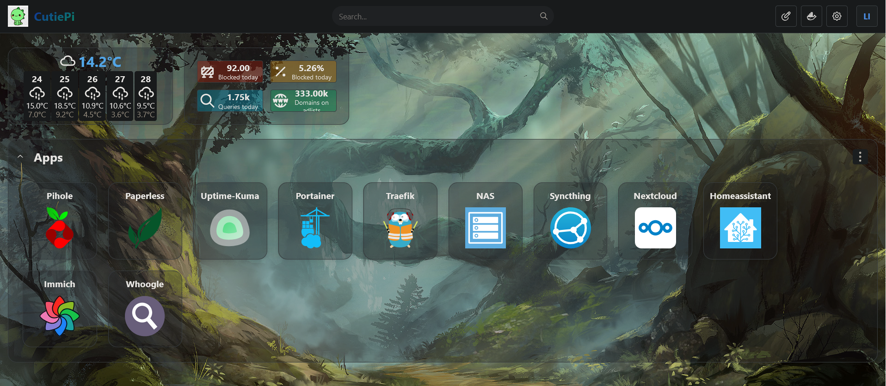

# Docker Containers

After a while of installing software locally on my Raspberry Pi, I realized the benefits of using containers instead, so I started using Docker.
This way, I have each application installed in a sandboxed environment for more security, all dependencies come with the container so there's no "But it works on my machine!" effect, and management is very convenient with easy to manage compose or Dockerfiles that can be used with version control (Git).


## Nextcloud
I run a Nextcloud instance in a container.
For this, I use the Nextcloud container that contains an Apache image to run the webserver, found <a href="https://github.com/nextcloud/docker" target="_blank">here</a>.
I installed using the provided Docker Compose file, but changed the volume mappings to `volumes : - ./cloud:/var/www/html - ./data:/var/www/html/data` so I didn't have to navigate to `/var/lib/docker/volumes/nextcloud` to find the Nextcloud files on the Docker host.
Anything I put in the data volume on the host will appear on `hostip:8080` on my webbrowser, and the other way around.
Note: You need to make sure the correct permissions are set (`sudo chown -R www-data:www-data /home/lily/nextcloud && sudo chmod -R 755 /home/lily/nextcloud`) so the Nextcloud user ('www-data') has access to the data.
I also had some problems with data being in the Nextcloud cache but not written on the disk after deletion of a user, which prevented file sync.
I resolved this by running some troubleshooting commands on the Docker host inside the Nextcloud container:
```bash
docker exec -u www-data nextcloud php occ files:cleanup #clear file cache in the Docker container
docker exec -u www-data nextcloud php occ files:scan --all #rescan all files
docker exec -u www-data nextcloud php occ maintenance:repair #maintenance repairs, eg. to fix database inconsistencies, adjust file paths, and address other issues that may arise in a Nextcloud installation
```

## Uptime Kuma
I use Uptime Kuma, a simple yet powerful monitoring tool, to receive notifications about my services.
You can configure lots of notification options, like Mail (simply google your mail provider + SMTP server), Signal, Pushover, etc.
I gave Uptime Kuma read only rights to the Docker socket, so I can configure the Pi as a Docker Host in Uptime Kuma, and comfortably monitor all my containers
with it. <br />
Another cool feature is the 'Upside Down' Status monitor, which I explain [here](scripts.md#uptime-kuma)
But as I want to prevent Docker containers not running in the first place, I wrote [this script](automation.md#keep-docker-compose-containers-running) to restart them if they go down.

## Traefik

### docker-compose.yml and traefik.yml
I use Traefik as a reverse proxy and loadbalancer.
I also configured self-signed SSL certificates with it, using the ACME protocol.
I did this by registering the 'witchessabath' Domain with Cloudflare, and getting **Cloudflare DNS API Key** for TLS encryption.
To create an API token, I logged in to Cloudflare's 'My Profile' page, then navigate to `API token` in the menu and created a token using a custom template:
<br />
*Above: The seetings needed for the API Key: Zone > Zone > Read and Zone > DNS > Write* <br />
In my Traefik Docker Compose file I then added the configuration:
```
 volumes:
      - /var/run/docker.sock:/var/run/docker.sock:ro
      - ./conf/traefik.yml:/traefik.yml
      - ./certs/acme.json:/acme.json
    environment:
      - CF_DNS_API_TOKEN=xxx
```
Traefik will now use `traefik.yml` as a configuration file.
You can view my Traefik configuration file <a href="https://github.com/witchessabath/containers/blob/main/traefik/conf/traefik.yml" target="_blank">here.</a>

### Labels
To use my self-signed TLS certificates for my Docker containers, I give them the following labels:
```yml
- traefik.enable=true
- traefik.http.routers.paperless.entrypoints=web,websecure #configure for HTTP or HTTPS traffic/HTTPS redirection
- traefik.http.routers.paperless.rule=Host(`app.witchessabath.com`)
- traefik.http.routers.paperless.tls=true
- traefik.http.routers.paperless.tls.certresolver=cloudflare #enter the name of the certificate resolver configured in traefik.yml
```
!!! note
    Be careful about the backticks: I originally used single quotes instead of backticks for the 'Host' label, and ran into an error (called 'invalid rune' in Go)

If a container already exists, you can also edit its labels with **Portainer**.
Note that the containers must be in the same Docker network as the Traefik container.
For non-Docker containers or services you didn't attach labels to, simply add the service to the traefik Docker Compose file.

## Watchtower
I use Watchtower to keep my Docker containers up to date.
Watchtower searches local or online repositories for newer versions of the installed containers, and then updates them with the exact same settings that were configured before.
Watchtower is itself a container installed with 
```
docker run -d \
  --name watchtower \
  -v /var/run/docker.sock:/var/run/docker.sock \
  containrrr/watchtower
```
## Homarr

*Above: Screenshot of my Homarr Dashboard*

I use Homarr to have a dashboard overview of the services I need to access on my Pi.
It also has cool API integrations, for example to display PiHole data.
I installed it using Docker Compose, then configured it via the GUI webinterface.
As I wanted to use a custom icon for the tab bar and on the site itself, I downloaded `dino.png` on my laptop and moved it to `~/homarr/icons` on my Pi, which I mapped to the logo directory in homarr using the line `- ./icons:/app/public/imgs/logo` under the `volumes:` section of my Docker Compose file.
You could also connect to the container CLI, navigate to the logo directory and use `wget <icon URL>` to download the icon in the container directly.
You can then change the icon by specifying the path to it (in the container) in the 'Settings' page on the Web GUI.

## Portainer
I use Portainer to have an overview and comfortable GUI management interface for all my Docker containers.
I find creating and managing Docker networks, assigning labels to containers, as well as reviewing container logs more comfortable through Portainer.
It also enables you to connect to a console and act as root user in the container, therefore replacing the need to use the `docker exec -it <containername> sh` command to access the container's CLI.
Portainer can be installed by creating a volume (`docker volume create portainer_data`) and then pulling the container for it (`docker run -d -p 8000:8000 -p 9443:9443 --name portainer --restart=always -v /var/run/docker.sock:/var/run/docker.sock -v portainer_data:/data portainer/portainer-ce:latest`).

## Paperless
I use Paperless as a document managagement system.
I configured it using a Docker Compose file, and added an environment file for more fine-grained configuraions with the entry `env_file: docker-compose.env`.
The database I use with it is Redis. (This is one of the benefits of using Docker Compose - simply start the file with `services:` and define multiple services in the file.)

## Troubleshooting
Some useful troubleshooting commands:

- `docker logs <container_name>` to view container logs
- `docker compose up -d --force-recreate` to activate changes after editing the compose file of a running Docker Compose container
- `docker exec -it <container_name> /bin/sh` to connect to the shell of the container
- `docker ps` and `docker network ls` to list running containers and Docker networks
- `docker inspect <container_name>` and `docker network inspect <network_name>` for details about the container/network