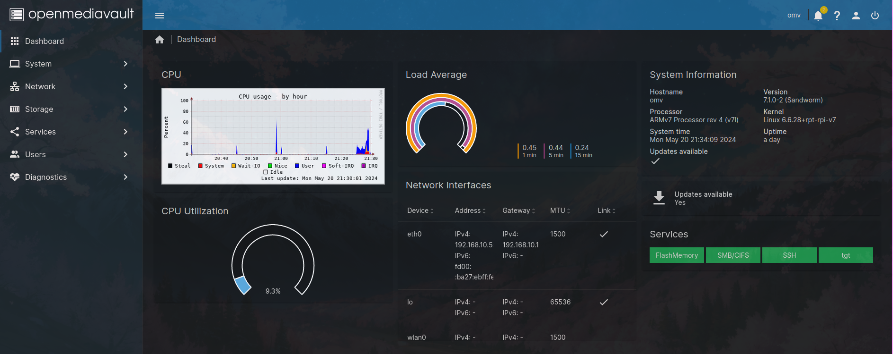

# File Sharing

## Network Attached Storage

I used Openmediavualt (OMV) to make a NAS out of my Raspberry Pi 3B+, to which I simply attached a HDD.


*Above: Screenshot of my OMV Dashboard*

## Preparations
- Install Raspberry Pi OS Lite
- Install OMV using the <a href="https://github.com/OpenMediaVault-Plugin-Developers/installScript/raw/master/install" target="_blank">installation script.</a>
- Wipe the drive(s) you wish to connect to your Pi. I did it like this:
    - Connect drive to PC, find out the device name by using `sudo fdisk -l` or `lsblk`
    - Use dd command to write zeros to the drive: `sudo dd if=/dev/zero of=/dev/sbdX bs=5M status=progress`
- Log onto the OMV Web GUI with the default `admin` user and `openmediavault` password, then change them and setup a new user
Make sure to put that user in the `SSH` group in the `Users` Tab, to ensure SSH connectivity
- I installed the `openmediavault-sharerootfs` plugin, to be able to share folders located on the root filesystem

!!! note
    You will still only be able to manage your disks, shares etc. with the admin user

- Check if disk is found under `Storage > Disks`
- Create and mount a file system on that disk under `Storage > File Systems` - I used ext4

## SMB Share Setup
- Create a folder on the disk under `Storage - Shared Folders`
- Make the SMB share browseable and configure other settings like minimum SMB version and permission inheritance under `Services > SMB/CIFS > Settings`
- Create the SMB Share in `Services > SMB/CIFS > Shares`
- Then add the share as a network drive in Windows, using the user credentials created before

## iSCSI LUN Setup
- Install the `openmediavault-tgt` plugin
- Go to `Services > tgt > Settings > Check "Enable"`

### Create an iSCSI image
There's two ways of doing this, by terminal or in the Web GUI.

=== "Terminal"

    Connect to the terminal locally or via SSH, and make a directory for the image, eg. `sudo mkdir /iscsiimg`, then use dd to make the empty image: `sudo dd if=/dev/zero of=/iscsiimg/lun1.img bs=1M count=5120`
    !!! note
        Don't forget the `count` parameter, to only make an image of your desired size (it counts blocks of the size specified in the `bs` parameter). Otherwise `dd` will copy an infinite stream of zeroes and wipe everything else out.

=== "GUI"

    Go to `Services > tgt > Images` and click "Create", then enter the full path you want the image to have, eg. "/iscisimg.lun1.img".

### Create an iSCSI Target
Go to `Services > tgt > Targets` and configure a target, with the image you just created as 'Backing Store'. As initiator I used my laptop and entered its hostname.
!!! note
    You also need to check the "Enabled" box for each target, otherwise it won't be found by the initiator.

### On the initiator:
- Install package `open-iscsi`
- Start iSCSI daemon with `sudo systemctl start iscsid`, if you want it to start on system startup automatically use `sudo systemctl enable iscsid`
- Discover the iSCSI target: run `sudo iscsiadm -m discovery -t st -p <OMV IP Adress>`
- Login using command `sudo iscsiadm -m node -T <ISCSI Target IQN> -p <OMV IP Adress> --login`. You can find the target's IQN in the OMV web GUI in the `tgt > Targets` page next to the name of the target you just created.
- Use the command `lsblk` to see the device name the LUN has on your system.
- Create a directory and then mount the LUN to it (`sudo mkdir /mnt/iscsi`, then `sudo mnt /dev/sdX /mnt/iscsi`)
- I got an error saying the image has the 'wrong fs type', as it has no filesystem configured, so I simply used `sudo mkfs -t ext4 /dev/sdX` to give it an ext4 filesystem
- You can now put files here. You can logout with `sudo iscsiadm -m node -T <ISCSI Target IQN> -p <OMV IP Adress> --logout`, and also just unmount and mount the LUN if you wish.

## Samba 

I also created a Samba Share on my Raspberry Pi for my home network.
To do this, install the packages `samba samba-common smbclient` and make a backup of the `/etc/samba/smb.conf` file, then create a new one with your custom entries.
Mine simply looks like this:
```
[global]
workgroup = WORKGROUP
security = user
client min protocol = SMB2
client max protocol = SMB3
map to guest = Bad User
guest account = nobody

[Samba]
path = /mnt/sambavolume
read only = no
guest ok = yes
```
This gives me the Share 'Samba'. Guest accounts are allowed, so no login is needed. The standard guest account is the Unix user 'nobody'. To ensure that everyone has permissions to the share, you also need to set them for the directory: `sudo chmod 777 /mnt/sambavolume`. If you want to only enable access for certain users, don't enable guest access in the configuration file and instead set the `valid users = ` option for the samba share. Then use `sudo smbpasswd -a <user>` to set login credentials to the share for the user.

### Creating a logical volume for the Samba file share
I wanted to set a size restriction for the Samba file share, so I decided to map it to a logical volume.
You can map the Samba file share to any directory you want using the `path = ` option.
To map it to a logical volume, I connected my Pi to an external SDD and did the follwing:

- install `lvm2` package
- use the `lsblk` command to find out the name of the SDD block device and create a physical volume on it using `sudo pvcreate /dev/sda`
- create a volume group on the phyiscal volume: `vgcreate volgroup1 /dev/sda`
- create the logical volume: `sudo lvcreate -L 250G volgroup1 -n sambavolume`. Now I have a 250 GiB volume called 'sambavolume'
- create ext4 filesystem on the volume: `mkfs.ext4 /dev/mapper/volgroup1-sambavolume` (as a logical volume is not a regular block device, all logical volumes are found under `/dev/mapper`. `/dev/mapper/volgroup1-sambavolume` is the full path to my sambavolume.)
- `sudo mkdir -p /mnt/sambavolume` and `sudo mount /dev/mapper/volgroup1-sambavolume /mnt/sambavolume` to mount the logical volume.
- to make persistent after reboots, I added an entry for the volume to `/etc/fstab`: `/dev/mapper/volgroup1-sambavolume /mnt/sambavolume ext4 defaults 0 2`

### Connecting to the share from Windows devices
To connect to the share using Windows devices, simply enter `\\<serverIP>\<sambasharename>` in the file explorer or map as new network device.
So in my case, `\\cutiepi\samba`. You are now automatically connected to whatever directory is specified as 'path' in the smb.conf file for this share.

