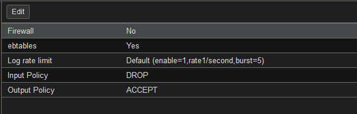
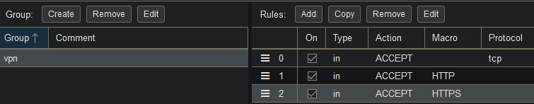
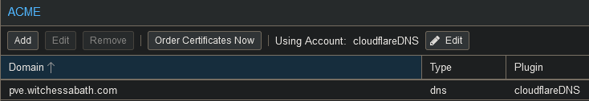

# Proxmox VE

Here are some notes on my Proxmox instance. Proxmox is a great type I hypervisor. I mainly use it to test software I don't want to immediately install in my production homelab environment.

## Installation and initial configuration
Here are the steps I took for a basic Proxmox install and setup to run some LXC containers:

- Download the official Proxmox VE ISO image to a bootable USB drive
- Go to the BIOS of your PC and enable virtualisation support
    - As I am running Proxmox on a HP PC with an Intel CPU, the virtualisation option to be enbled was **'System Options -> Virtualization Technology (VTx)'**
- Go through the initial Proxmox install instructions for Proxmox VE with GUI
- Now Proxmox is running and can be configured on the web interface `https://(hostIP):8006`
- Name your cluster. The host 'pve' is now a node in this cluster.
- Select the node in the side menu, then navigate to 'Updates > Repositories'
    - Here you can select the software repositories your system can install packages from. There are some default repositories, here I disabled the Proxmox Enterprise repository as I have no enterprise subscription. Instead I clicked on 'Add' and added the `pve-no-subscription` repo.
    - Now you can go back to 'Update' and click 'Refresh', then 'Upgrade'. This performs an `apt update && upgrade` on the node.
    - If you use Proxmox without a subscription, a window pops up to remind you it's not recommend. This can be disabled by changing the `proxmoxlib.js` file and then restarting the service for the webinterface (`pveproxy.service`), like in <a href="https://johnscs.com/remove-proxmox51-subscription-notice/" target="_blank">these instructions.</a>

## LXC Container setup
You can run either VMs or LXC Containers (Linux Containers) on Proxmox VE.
I chose to first deploy some containers, as I wanted to run Linux systems and containers share the same kernel with the host. This makes them really lightweight and fast.
To deploy a container, go to the node in your sidemenu and select the menupoint `local`.
Here you will find a sub-menu with the point `Container Templates`, where you can browse a big list of Linux images, which you can download.
These templates can be used for deploying containers with this OS. There's also preconfigured containers that have certain software already installed.
After the template has finished downloading, you can click the big `Create CT` button on the top right of the Web GUI. This will start a setup wizard where you can choose the node it will run on, create a user/password and SSH keys, and the virtual hardware specs.

!!! Note
    I chose 'Use Host DNS Settings' in the container setup wizard, but as I wanted to install software, I noticed DNS was not working for me. I had to manually edit the container configuration file on the pve node (`/etc/pve/lxc/<container_id>.conf`). I added the line `lxc.environment = DNS_SERVER=1.1.1.1 1.0.0.1`, then entered the container from the command line with `pct enter <container_id>` and adjusted its `/etc/resolv.conf` file to use these nameservers as well.
    Then DNS resolution worked and I could run my first `apt update && upgrade` and then install packages.

## VM Setup
In the side menu under your node, select `local` then go to `Content > ISO Images` and click `Upload`. Now you can upload an ISO from your local PC.
Then go to `Create VM` on the top right.
I did this as I wanted a graphical Debian install.
### NFS Server
I used my VM to setup an NFS Server by doing the following:

- install the `nfs-kernel-server` package
- create a directory for the share, eg. `sudo mkdir -p /srv/nfs/share` and set the permissions
    - As I'm not doing this in a production evironment, I used `chown nobody:nogroup` and `chmod 755`
- edit the `/etc/exports` file to specify allowed clients. I wanted to allow all clients in my network, so I added the line `/srv/nfs/share *(rw,sync,no_subtree_check)`
- then update the NFS Server configuration by executing `exportfs -ra`

## Firewall
In the Datacenter menu, expand the `Firewall` menu point. 
I recommend first going to `Security Groups` and creating a new group - which is simply a set of rules. 
These can then later be added to both the node(s) and the VMs/Containers running on the system. This is very practical, as you don't have to create some standard rules over and over again to apply to different nodes or VMs.
In the Security Group, you can click the `Add` button to create rules. A window will pop up with the option to create rules applying either a predefined Macro (e.g. HTTPS or FTP), or by selecting the protocol.  
You can add seperate rules on every layer of the system, from the whole datacenter to a single container. They will be applied from the first rule on the `Firewall` menu down to the last rule, so be careful about your rule order.

!!! note
    An important aspect in Proxmox is that you should create these rules first and then enable the firewall - because it's disabled by default.
    You can do so in the `Firewall > Options` menu. Be careful if you enable the firewall before creating any rules - because the default policy is set to `DROP` (but can be changed here). So you might accidentally lock yourself out of your system, if you don't create some `ACCEPT` rules first.  

*Above: The Firewall Options menu, where the firewall must first be enabled on the Datacenter level*  
I created a Security Group for my VPN connection to allow HTTP, HTTPS, and TCP traffic on port 8006 to allow access to Proxmox from my VPN.
(This is very practical as I also enabled Wake on LAN fo the Proxmox node, and now I can access my containers from anywhere when I need them, without having to keep the PC running 24/7.)
!!! note
    Be sure to create the rule for port 8006/the port where the Proxmox VE API is exposed: otherwise you won't be able to access the Proxmox web interface, even with HTTP(S) enabled.  
  
*Above: Screenshot of a VPN security group, made by selecting Macros (HTTP/HTTPS) or a protocol and destination port (TCP to port 8006).*  
## TLS Certificates
To deploy self signed TLS certificates:

- navigate to `Datacenter > ACME`.
- click `Challenge Plugins > Add` to add a DNS challenge from your provider. I use Cloudflare, so I entered my Cloudflare mail and created a Cloudflare API token.
    - to create an API token, I logged in to Cloudflare's 'My Profile' page, then navigate to 'API token' in the menu and created a token using the Zone DNS template, giving permission for zones in my account.
- go to `Accounts > Add` and add the mail address used for the DNS Challenge Plugin. Now, select 'Let's Encrypt V2' from the Dropdown Menu
- next, go to your node(s) and select `Certificates` from the side menu. Under `ACME`, click `Add` and add a domain and select 'DNS' under `Plugin Type` 
- In the top menu, select the previously created account in the `Using account: ` dropdown menu, then click `Apply`

*Above: ACME configuration for my PVE node*  
## Backups
Here's how I setup a backup to my NFS Share for the VM file systems:

- On your Proxmox Datacenter tab, go to `Storage` and click `Add > NFS`
- Enter a name in the `ID` field, then enter the server IP and select the NFS Share path under `Export`. For content, make sure to select the option `VZDump backup files`
- Then go to `Backup`, and click `Add` to add a backup job. **Select your NFS Share as storage** and determine a schedule for the backup to run.   Make sure to keep more than the last backup by modifying the retention time in the `Retention` tab.
## Users and 2FA Authentication
In the Datacenter Menu, go to `Permissions > Users` to create a new user. In the `Two Factor` menu point beneath that, you can set up 2FA, for example with an authenticator app.
## Hostname Change
I changed the hostname using the `hostnamectl set-hostname` command, but I did not realize that in Proxmox, the hostname is also the node name.
That's why after a reboot, the naming was no longer consistent and I could no longer access the web interface. Instead, you need to edit both `/etc/hosts` and `/etc/hostname` and replace all instances of the old hostname.
If your node is in a cluster, make sure to also change the node name in `/etc/pve/corosync.conf`.